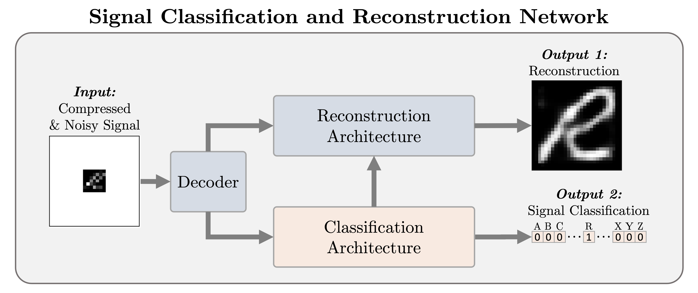

# Signal Classification and Reconstruction Network (SCRNet)
The <b>Signal Classification and Reconstruction Network (SCRNet)</b> is a deep neural network architecture designed to handle compressed and noisy character images signals. Tailored for tasks like character recognition and image signal restoration, SCRNet integrates classification and reconstruction pathways, enhancing performance and robustness through their synergistic interaction.

<strong>Jupyter notebooks should be run in the following order::</strong>
<ul>
  <li><b><em>create_comp_noisy_emnist_letters_training_data.ipynb</em></b>: Create compressed/noisy EMNIST training and test data </li>
  <li><b><em>scrnet_train_models_emnist_tf.ipynb</em></b>: Train SCRNet architectures using compressed/noisy EMNIST training data </li>
  <li><b><em>scrnet_model_analysis.ipynb</em></b>: Analysis of models using test data </li>
</ul>
